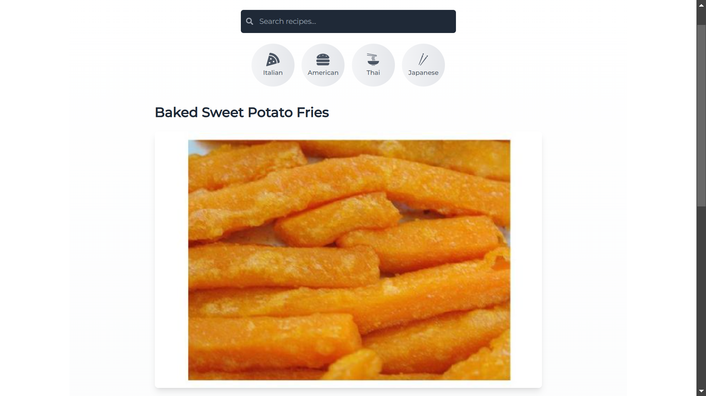

# 🍳 Spoonacular Recipe App

<div align="center">
  <h3>Discover, Cook, and Enjoy Delicious Recipes</h3>
  <p>A modern recipe discovery application built with React, powered by the Spoonacular API</p>
  
  [](https://deepakpatil26.github.io/react-recipe-app/)
  [](LICENSE)
  [](https://reactjs.org/)
  [](https://tailwindcss.com/)
</div>

## ✨ Features

- 🔍 **Smart Search**: Find recipes by name, ingredients, or cuisine type
- 🌎 **Cuisine Categories**: Explore recipes from Italian, American, Thai, and Japanese cuisines
- 📱 **Responsive Design**: Seamless experience across all devices
- 🎨 **Modern UI/UX**: Beautiful interface with smooth animations using Framer Motion
- ⚡ **Fast Loading**: Optimized performance with loading skeletons for better user experience
- 🛡️ **Error Handling**: Graceful error handling with user-friendly messages
- 🔄 **Real-time Updates**: Dynamic content updates without page reloads

## 🖥️ Screenshots

<div align="center">
  
  <p><em>Home Page with Popular and Vegetarian Recipes</em></p>
  
  
  <p><em>Detailed Recipe View with Ingredients and Instructions</em></p>
  
  
  <p><em>Recipe Summary with Nutritional Information</em></p>
  
  
  <p><em>Responsive Mobile Design</em></p>
</div>

## 🛠️ Built With

- **Frontend Framework**: [React](https://reactjs.org/)
- **Routing**: [React Router v7](https://reactrouter.com/)
- **Styling**: [Tailwind CSS](https://tailwindcss.com/)
- **Animations**: [Framer Motion](https://www.framer.com/motion/)
- **Icons**: [React Icons](https://react-icons.github.io/react-icons/)
- **API**: [Spoonacular API](https://spoonacular.com/food-api)
- **Deployment**: [GitHub Pages](https://pages.github.com/)

## 🚀 Quick Start

1. **Clone the repository**
   ```bash
   git clone https://github.com/deepakpatil26/react-recipe-app.git
   cd react-recipe-app
   ```

2. **Install dependencies**
   ```bash
   npm install
   ```

3. **Set up environment variables**
   - Create a `.env` file in the root directory
   - Add your Spoonacular API key:
     ```env
     REACT_APP_FOOD_API_KEY=your_api_key_here
     ```

4. **Start the development server**
   ```bash
   npm start
   ```

5. **Open [http://localhost:3000](http://localhost:3000) in your browser**

## 📱 Mobile Responsiveness

The app is fully responsive and provides an optimal viewing experience across a wide range of devices:
- 💻 Desktop
- 💪 Tablet
- 📱 Mobile
- 📱 Small Mobile Devices

## 🌟 Key Components

- **Search Component**: Real-time recipe search functionality
- **Category Navigation**: Easy cuisine type filtering
- **Recipe Cards**: Beautiful presentation of recipe information
- **Detailed Recipe View**: Complete recipe information with ingredients and instructions
- **Loading Skeletons**: Smooth loading states for better UX
- **Error Boundaries**: Graceful error handling throughout the app

## 🚀 Deployment

The app is deployed on GitHub Pages. To deploy your own version:

1. Update the homepage in `package.json`:
   ```json
   {
     "homepage": "https://yourusername.github.io/react-recipe-app"
   }
   ```

2. Deploy to GitHub Pages:
   ```bash
   npm run deploy
   ```

🔗 **Live Demo**: [https://deepakpatil26.github.io/react-recipe-app/](https://deepakpatil26.github.io/react-recipe-app/)

## 🤝 Contributing

Contributions are welcome! Feel free to:
1. Fork the repository
2. Create your feature branch (`git checkout -b feature/AmazingFeature`)
3. Commit your changes (`git commit -m 'Add some AmazingFeature'`)
4. Push to the branch (`git push origin feature/AmazingFeature`)
5. Open a Pull Request

## 📝 License

This project is licensed under the MIT License - see the [LICENSE](LICENSE) file for details.

## 👨‍💻 Author

**Deepak Patil**
- GitHub: [@deepakpatil26](https://github.com/deepakpatil26)

## 🙏 Acknowledgments

- [Spoonacular API](https://spoonacular.com/food-api) for providing the recipe data
- [React Icons](https://react-icons.github.io/react-icons/) for the beautiful icons
- [Tailwind CSS](https://tailwindcss.com/) for the styling utilities
- [Framer Motion](https://www.framer.com/motion/) for smooth animations

---

<div align="center">
  Made with ❤️ by <a href="https://github.com/deepakpatil26">Deepak Patil</a>
</div>